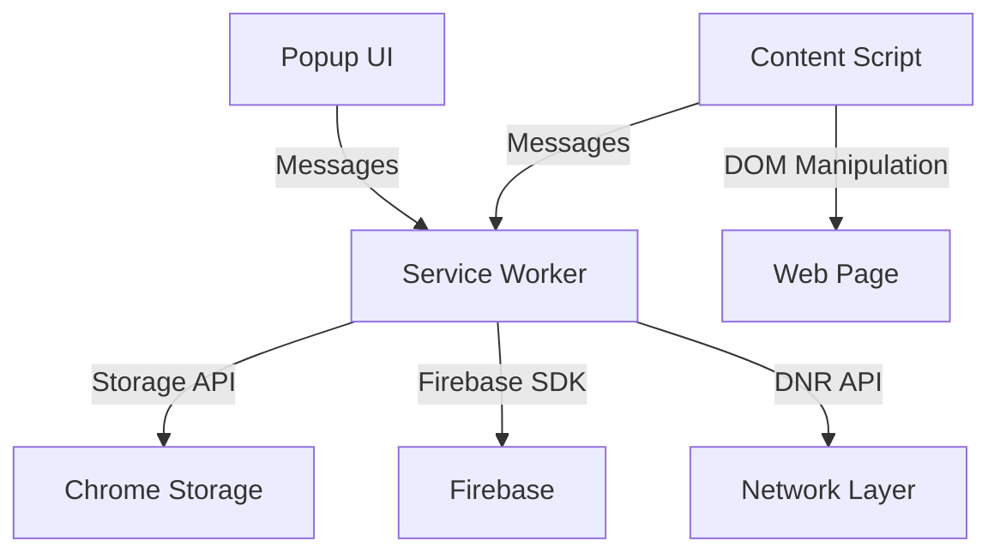

# ShieldPro Ultimate - Developer Documentation

## Table of Contents
1. [Development Setup](#development-setup)
2. [Project Structure](#project-structure)
3. [Build Process](#build-process)
4. [Testing](#testing)
5. [Firebase Setup](#firebase-setup)
6. [Contributing](#contributing)
7. [Architecture](#architecture)
8. [Deployment](#deployment)

## Development Setup

### Prerequisites
- Node.js 22.x (for Firebase functions)
- Node.js 24.x (for extension development)
- Yarn package manager
- Firebase CLI
- Git

### Initial Setup

1. **Clone Repository**
```bash
git clone https://github.com/shieldpro/ultimate.git
cd shieldpro-ultimate
```

2. **Install Dependencies**
```bash
yarn install
cd firebase/functions && yarn install
cd ../..
```

3. **Environment Configuration**
```bash
cp .env.example .env
# Edit .env with your Firebase credentials
```

4. **Firebase Setup**
```bash
firebase login
firebase init
# Select: Firestore, Functions, Storage, Hosting, Emulators
```

5. **Start Development**
```bash
# Terminal 1: Start Firebase emulators
firebase emulators:start

# Terminal 2: Start webpack dev server
yarn dev
```

## Project Structure

```
shieldpro-ultimate/
├── src/
│   ├── background/           # Service worker & background scripts
│   │   ├── service-worker.ts
│   │   ├── filter-engine.ts
│   │   ├── tier-manager.ts
│   │   └── performance-monitor.ts
│   ├── content/              # Content scripts
│   │   ├── content-script.ts
│   │   ├── injector.ts
│   │   ├── youtube-blocker.ts
│   │   └── cookie-consent-blocker.ts
│   ├── popup/                # Extension popup UI
│   │   ├── App.tsx
│   │   ├── components/
│   │   └── hooks/
│   ├── options/              # Options page
│   │   ├── Options.tsx
│   │   └── pages/
│   ├── config/               # Configuration files
│   │   └── firebase.ts
│   ├── services/             # Service layer
│   │   └── auth.service.ts
│   └── shared/               # Shared utilities
│       ├── types/
│       ├── utils/
│       └── constants/
├── public/                   # Static assets
│   ├── manifest.json         # Chrome manifest
│   ├── manifest.firefox.json # Firefox manifest
│   ├── manifest.edge.json    # Edge manifest
│   ├── icons/
│   ├── rules/                # Declarative net request rules
│   └── _locales/
├── firebase/                 # Firebase configuration
│   ├── firestore.rules
│   └── functions/
│       └── src/
│           └── index.ts
├── tests/                    # Test files
│   ├── unit/
│   ├── integration/
│   └── e2e/
├── scripts/                  # Build & utility scripts
│   ├── build-browsers.js
│   └── release.js
└── docs/                     # Documentation
```

## Build Process

### Development Build
```bash
# Chrome development build
BUILD_TARGET=chrome yarn dev

# Firefox development build
BUILD_TARGET=firefox yarn dev

# Watch mode
yarn watch
```

### Production Build
```bash
# Build for all browsers
yarn build:all

# Build for specific browser
yarn build:chrome
yarn build:firefox
yarn build:edge

# Create release packages
yarn package:all
```

### Build Configuration

#### Webpack Configuration
```javascript
// webpack.config.js
module.exports = {
  entry: {
    background: './src/background/service-worker.ts',
    content: './src/content/content-script.ts',
    popup: './src/popup/index.tsx',
    options: './src/options/index.tsx'
  },
  // ... configuration
};
```

#### Environment Variables
```bash
# .env
REACT_APP_FIREBASE_API_KEY=xxx
REACT_APP_FIREBASE_AUTH_DOMAIN=xxx
REACT_APP_FIREBASE_PROJECT_ID=xxx
BUILD_TARGET=chrome
USE_FIREBASE_EMULATOR=true
```

## Testing

### Unit Tests
```bash
# Run all unit tests
yarn test:unit

# Run with coverage
yarn test:coverage

# Watch mode
yarn test:watch
```

### Integration Tests
```bash
# Run integration tests
yarn test:integration

# Test Firebase functions
cd firebase/functions
npm test
```

### E2E Tests
```bash
# Build extension first
yarn build

# Run E2E tests
yarn test:e2e
```

### Test Structure
```typescript
// Example test file
describe('TierManager', () => {
  it('should upgrade tier when conditions are met', async () => {
    const manager = new TierManager();
    const result = await manager.upgradeTier(2);
    expect(result.success).toBe(true);
    expect(result.tier).toBe(2);
  });
});
```

## Firebase Setup

### Project Configuration

1. **Create Firebase Project**
```bash
# Visit https://console.firebase.google.com
# Create new project: shieldpro-ultimate
# Enable: Authentication, Firestore, Functions, Storage
```

2. **Get Configuration**
```javascript
// Firebase Console → Project Settings → General
const firebaseConfig = {
  apiKey: "...",
  authDomain: "...",
  projectId: "...",
  storageBucket: "...",
  messagingSenderId: "...",
  appId: "...",
};
```

3. **Deploy Rules & Functions**
```bash
# Deploy Firestore rules
firebase deploy --only firestore:rules

# Deploy Cloud Functions
firebase deploy --only functions

# Deploy everything
firebase deploy
```

### Firestore Structure
```
users/
  {userId}/
    - uid: string
    - email: string
    - tier: object
    - stats: object
    - preferences: object

blockingStats/
  {userId}/
    - totalBlocked: number
    - domainStats: map
    - categoryStats: map

referrals/
  {referralId}/
    - referrerId: string
    - referredId: string
    - timestamp: timestamp
```

### Cloud Functions
```typescript
// Tier management
exports.checkTierUpgrade
exports.processReferral
exports.updateBlockingStats

// Scheduled functions
exports.checkWeeklyEngagement // Daily at 00:00
exports.cleanupOldData // Weekly on Sunday
```

## Architecture

### Component Communication



### Tier System Flow
```
Install → Tier 1 (Basic)
    ↓
Create Account → Tier 2 (Enhanced)
    ↓
Complete Profile → Tier 3 (Professional)
    ↓
30 Referrals → Tier 4 (Premium)
    ↓
Weekly Use → Tier 5 (Ultimate)
```

### Message Passing
```typescript
// Popup → Background
chrome.runtime.sendMessage({
  action: 'tierUpgraded',
  tier: 2
});

// Background → Content
chrome.tabs.sendMessage(tabId, {
  action: 'updateSettings',
  settings: {...}
});

// Content → Background
chrome.runtime.sendMessage({
  action: 'adBlocked',
  domain: 'example.com'
});
```

## Contributing

### Development Workflow

1. **Fork & Clone**
```bash
git clone https://github.com/YOUR_USERNAME/shieldpro-ultimate.git
cd shieldpro-ultimate
git remote add upstream https://github.com/shieldpro/ultimate.git
```

2. **Create Feature Branch**
```bash
git checkout -b feature/your-feature
```

3. **Make Changes**
```bash
# Make your changes
yarn lint
yarn test
git add .
git commit -m "feat: add new feature"
```

4. **Push & PR**
```bash
git push origin feature/your-feature
# Create Pull Request on GitHub
```

### Coding Standards

#### TypeScript
```typescript
// Use explicit types
interface UserProfile {
  uid: string;
  email: string;
  tier: TierInfo;
}

// Use async/await
async function fetchUser(): Promise<UserProfile> {
  const user = await authService.getCurrentUser();
  return user;
}

// Handle errors properly
try {
  await someAsyncOperation();
} catch (error) {
  console.error('Operation failed:', error);
  // Handle error appropriately
}
```

#### React Components
```tsx
// Use functional components
const TierBadge: React.FC<{tier: number}> = ({ tier }) => {
  return <div className="tier-badge">Tier {tier}</div>;
};

// Use hooks
const [loading, setLoading] = useState(false);
useEffect(() => {
  // Effect logic
}, [dependency]);
```

### Commit Convention
```
feat: add new feature
fix: fix bug
docs: update documentation
style: format code
refactor: refactor code
test: add tests
chore: update dependencies
```

## Deployment

### Pre-deployment Checklist
- [ ] All tests passing
- [ ] Lint checks pass
- [ ] Version bumped in manifest.json and package.json
- [ ] CHANGELOG.md updated
- [ ] Documentation updated
- [ ] Firebase rules deployed
- [ ] Cloud functions deployed

### Build Release
```bash
# 1. Update version
npm version patch # or minor, major

# 2. Build all browser packages
yarn build:all

# 3. Create release packages
yarn package:all

# 4. Deploy Firebase
firebase deploy

# 5. Tag release
git tag v1.0.0
git push origin v1.0.0
```

### Store Submission

#### Chrome Web Store
1. Build Chrome package: `yarn package:chrome`
2. Visit [Chrome Developer Dashboard](https://chrome.google.com/webstore/devconsole)
3. Upload `builds/shieldpro-chrome.zip`
4. Fill in store listing details
5. Submit for review

#### Firefox Add-ons
1. Build Firefox package: `yarn package:firefox`
2. Visit [Firefox Developer Hub](https://addons.mozilla.org/developers)
3. Upload `builds/shieldpro-firefox.zip`
4. Complete submission form
5. Submit for review

#### Edge Add-ons
1. Build Edge package: `yarn package:edge`
2. Visit [Edge Developer Dashboard](https://partner.microsoft.com/dashboard)
3. Upload `builds/shieldpro-edge.zip`
4. Complete listing information
5. Submit for certification

### Post-deployment
```bash
# Monitor for issues
firebase functions:log

# Check error tracking
# Monitor user feedback
# Prepare hotfix if needed
```

## API Reference

### Chrome Extension APIs
```typescript
// Storage
chrome.storage.local.set({key: value});
chrome.storage.local.get(['key']);

// Messaging
chrome.runtime.sendMessage({action: 'name'});
chrome.runtime.onMessage.addListener(handler);

// Tabs
chrome.tabs.query({active: true});
chrome.tabs.sendMessage(tabId, message);

// Declarative Net Request
chrome.declarativeNetRequest.updateEnabledRulesets({
  enableRulesetIds: ['tier1_rules'],
  disableRulesetIds: ['tier2_rules']
});
```

### Firebase APIs
```typescript
// Authentication
signUp(email, password, displayName?, referralCode?);
signIn(email, password);
signOut();

// Firestore
setDoc(doc(db, 'users', uid), data);
getDoc(doc(db, 'users', uid));
updateDoc(doc(db, 'users', uid), updates);

// Functions
httpsCallable('checkTierUpgrade')();
httpsCallable('processReferral')({referralCode});
```

## Troubleshooting

### Common Development Issues

#### Extension Not Loading
```bash
# Check manifest syntax
cat public/manifest.json | jq .

# Check for errors
chrome://extensions → Details → Errors

# Rebuild
yarn build:chrome
```

#### Firebase Connection Issues
```bash
# Check emulators running
firebase emulators:start

# Verify environment variables
echo $USE_FIREBASE_EMULATOR

# Check Firebase config
cat src/config/firebase.ts
```

#### Build Failures
```bash
# Clear cache
rm -rf node_modules dist
yarn install
yarn build

# Check Node version
node -v # Should be 24.x for extension
cd firebase/functions && node -v # Should be 22.x
```

## Resources

### Documentation
- [Chrome Extension Docs](https://developer.chrome.com/docs/extensions/mv3/)
- [Firefox Extension Docs](https://developer.mozilla.org/en-US/docs/Mozilla/Add-ons)
- [Firebase Docs](https://firebase.google.com/docs)
- [TypeScript Docs](https://www.typescriptlang.org/docs/)

### Tools
- [Chrome Extension DevTools](https://developer.chrome.com/docs/extensions/mv3/devtools/)
- [Firefox Extension Workshop](https://extensionworkshop.com/)
- [Firebase Console](https://console.firebase.google.com/)
- [Webpack Bundle Analyzer](https://github.com/webpack-contrib/webpack-bundle-analyzer)

### Community
- GitHub: [github.com/shieldpro/ultimate](https://github.com/shieldpro/ultimate)
- Discord: [discord.gg/shieldpro](https://discord.gg/shieldpro)
- Forum: [community.shieldpro.com](https://community.shieldpro.com)

---

© 2024 ShieldPro Ultimate. All rights reserved.